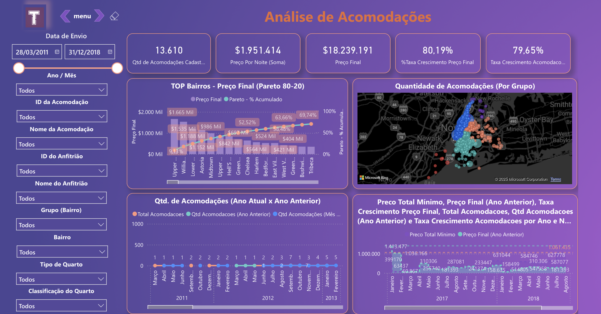
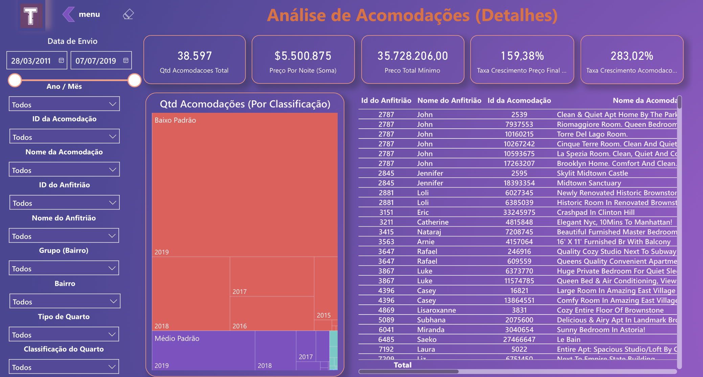

# Análise de Expansão de Negócio – Power BI

## Contexto de Negócio
A Tudo Aqui é uma empresa brasileira de e-commerce em crescimento, que historicamente tomou decisões de forma intuitiva, sem apoio consistente de dados. Algumas decisões estratégicas resultaram em prejuízos financeiros.

Diante de um plano de expansão para o ramo de locação de quartos, o CEO solicitou uma análise orientada por dados, utilizando informações públicas do Airbnb da cidade de Nova York (2011–2017), para apoiar decisões estratégicas.

## Objetivo
Desenvolver um relatório gerencial no Power BI com dashboards interativos para:

- Analisar preços e volume de acomodações
- Avaliar crescimento ao longo do tempo
- Identificar distribuição geográfica das acomodações
- Classificar estrategicamente os tipos de acomodação

## Fonte dos Dados
- Base: Airbnb Open Data – New York City (2011–2017)  
- Link: [Kaggle](https://www.kaggle.com/datasets/dgomonov/new-york-city-airbnb-open-data)

## Tratamento e Preparação dos Dados
- Remoção de valores nulos, em branco e inconsistentes
- Padronização de tipos de dados e textos
- Exclusão de linhas com dados incompletos
- Criação de tabela calendário para análises temporais

Colunas utilizadas: `last_review`, `id`, `name`, `host_id`, `host_name`, `neighbourhood_group`, `neighbourhood`, `latitude`, `longitude`, `room_type`, `price`, `minimum_nights`, `number_of_reviews`.

## Regras de Negócio
### Preço Final

Preço Final = Preço por noite × Quantidade mínima de noites

### Classificação das Acomodações
- Baixo Padrão: ≤ 1.000  
- Médio Padrão: > 1.000 e ≤ 10.000  
- Alto Padrão: > 10.000 e ≤ 100.000  
- Altíssimo Padrão: > 100.000  

Um índice foi criado para organizar a classificação nas segmentações.

## KPIs / Métricas
- Quantidade de acomodações cadastradas  
- Preço por noite (soma)  
- Preço final mínimo  
- Percentual de crescimento do preço final  
- Percentual de crescimento de acomodações

Exemplo de medida DAX:

Vendas Mês Anterior =
CALCULATE(
    [Total Vendas],
    PREVIOUSMONTH('Calendario'[Data])
)

## Visualizações

- Dashboard Analítico: visão gráfica e estratégica

- Gráfico de colunas e linhas (Top 100 bairros – Curva 80/20)
- Crescimento anual de acomodações e preço final

- Dashboard Detalhado: tabelas e matrizes para exploração dos dados

- Distribuição geográfica por grupo de bairros
- Segmentações por data, acomodação, anfitrião, localização, tipo e classificação do quarto

## Ferramentas Utilizadas
- Power BI Desktop
- Power Query
- DAX
- Modelagem Dimensional

## Observações
Projeto desenvolvido com dados públicos e empresa fictícia, para fins educacionais e de demonstração, sendo parte de um portfólio profissional em Análise de Dados.
